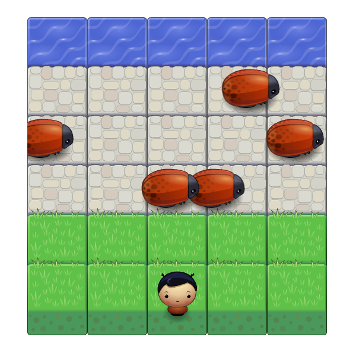

# Classic Arcade Game Clone

A Frogger-inspired game. Get from one side to the other without getting hit. But watch out, enemies will try to stop you from crossing safely!

## Getting Started

Open index.html in your browser of choice.

## Dependencies

- app.js
- engine.js
- resources.js

## How To Play

Use the arrow keys (← ↑ → ↓) to control the player character. 

Cross to the other side, avoiding enemies along the way. If you get hit, you’ll be reset back to the beginning. Cross successfully to win the game; continue playing to increase your score — you can play as long as you like!